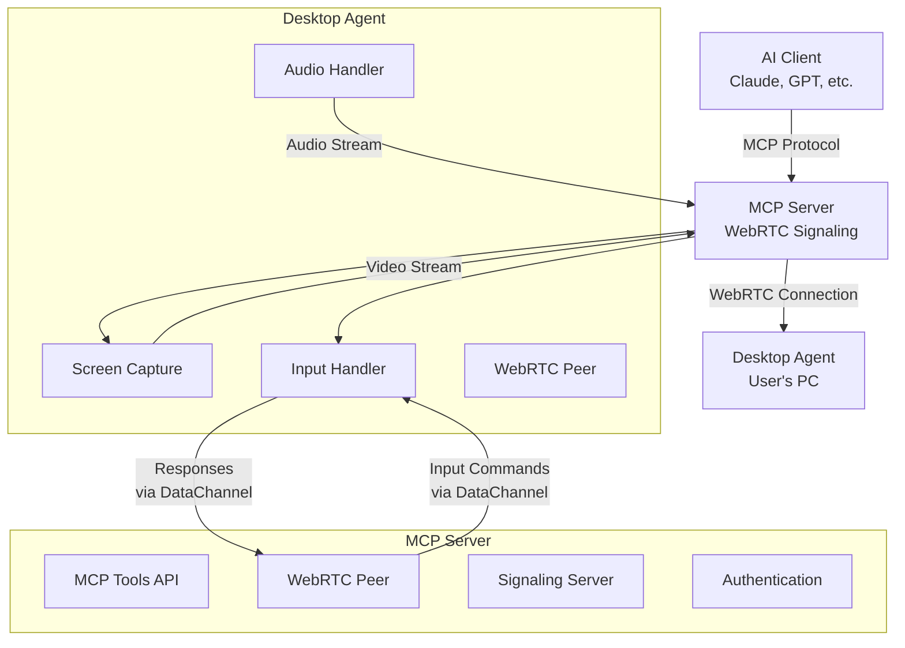

# Desktop MCP Server

A **WebRTC-based Model Context Protocol (MCP) server** that enables AI agents (Claude, GPT, etc.) to control remote desktops in real-time through screen sharing, audio communication, and input automation.

[](https://github.com/jagjerez-org/desktop-mcp-server/actions/workflows/ci.yml)
[](https://www.npmjs.com/package/@desktop-mcp/server)
[](https://opensource.org/licenses/MIT)

## 🎯 Vision

Transform how AI agents interact with computers by providing real-time desktop control through WebRTC. No more blind command execution—agents can see what they're doing and respond dynamically to visual feedback.

## 🏗️ Architecture



### Data Flow

1. **Screen Capture**: Desktop agent captures screen → WebRTC video stream → MCP server
2. **Visual Feedback**: AI requests frame → Server extracts from video stream → Returns as base64 image
3. **Input Commands**: AI sends mouse/keyboard command → Server forwards via DataChannel → Agent executes
4. **Audio Communication**: Bidirectional audio for TTS and microphone capture
5. **File Transfer**: Send/receive files through WebRTC DataChannel

## 🚀 Features

### MCP Tools (19 total)

| Category | Tools | Description |
|----------|-------|-------------|
| **Connection** | `desktop_connect`, `desktop_disconnect`, `desktop_status` | Manage WebRTC connections |
| **Visual** | `get_frame`, `get_frames`, `get_screen_info` | Screen capture and monitoring |
| **Mouse** | `mouse_move`, `mouse_click`, `mouse_drag`, `mouse_scroll` | Complete mouse control |
| **Keyboard** | `keyboard_type`, `keyboard_press`, `keyboard_hold` | Text input and key combinations |
| **Clipboard** | `clipboard_read`, `clipboard_write` | Clipboard operations |
| **Audio** | `audio_speak`, `audio_listen` | TTS and microphone capture |
| **System** | `shell_exec`, `file_transfer` | Command execution and file operations |

### Key Features

- 🔒 **Secure pairing** with 6-digit codes and HMAC tokens
- 🎥 **Real-time screen sharing** via WebRTC
- 🎤 **Bidirectional audio** for TTS and voice input
- ⚡ **Low latency** input control with visual feedback
- 🔄 **Auto-reconnection** and connection recovery
- 🌐 **Cross-platform** support (Windows, macOS, Linux)
- 📊 **Connection monitoring** with latency and quality metrics

## 📦 Installation

This project uses npm workspaces. Install from the monorepo root:

```bash
# Clone the repository
git clone https://github.com/jagjerez-org/desktop-mcp-server.git
cd desktop-mcp-server

# Install dependencies
npm install

# Build all packages
npm run build
```

Or install individual packages:

```bash
# MCP Server
npm install -g @desktop-mcp/server

# Desktop Agent
npm install -g @desktop-mcp/agent
```

## 🔧 Quick Start

### 1. Start the MCP Server

```bash
# From monorepo
npm run start:server

# Or from global install
desktop-mcp-server
```

The server will:
- Start MCP server (stdio transport for AI clients)
- Start WebRTC signaling server on port 8080
- Display startup information and pairing instructions

### 2. Start the Desktop Agent

```bash
# Initialize configuration
npm run start:agent -- --init

# Start agent
npm run start:agent

# Or from global install
desktop-mcp-agent --init
desktop-mcp-agent
```

The agent will:
- Connect to signaling server
- Display a 6-digit pairing code on screen
- Wait for pairing with MCP server

### 3. Pair the Devices

When the AI client first connects:
1. Agent displays: `📱 Pairing code: 123456`
2. MCP server prompts for code during first connection
3. Enter the 6-digit code to establish trusted connection
4. Future connections use saved authentication token

### 4. Connect from AI Client

```typescript
// Example: Connect AI to desktop
import { MCPClient } from '@modelcontextprotocol/sdk/client';

const client = new MCPClient({
  name: "desktop-control-client",
  version: "1.0.0"
});

// Connect to MCP server
await client.connect({
  command: "desktop-mcp-server",
  args: []
});

// Get available tools
const tools = await client.listTools();

// Connect to desktop
await client.callTool("desktop_connect", {
  deviceId: "your-device-id"
});

// Capture screen
const frame = await client.callTool("get_frame", {
  quality: 80
});

// Control mouse
await client.callTool("mouse_click", {
  x: 100,
  y: 200,
  button: "left"
});
```

## 🛠️ Configuration

### Server Configuration

Create `server-config.json`:

```json
{
  "port": 8080,
  "signalingPort": 8080,
  "maxConnections": 10,
  "tokenExpiry": 2592000,
  "pairingCodeExpiry": 300,
  "webrtc": {
    "iceServers": [
      { "urls": "stun:stun.l.google.com:19302" }
    ],
    "maxBitrate": 5000000,
    "maxFramerate": 30
  }
}
```

### Agent Configuration

Create `agent-config.json`:

```json
{
  "signalingUrl": "ws://localhost:8080",
  "deviceName": "My Desktop",
  "autoReconnect": true,
  "reconnectInterval": 5000,
  "capture": {
    "quality": 80,
    "frameRate": 30,
    "maxResolution": {
      "width": 1920,
      "height": 1080
    }
  },
  "audio": {
    "enabled": true,
    "config": {
      "sampleRate": 48000,
      "channels": 2,
      "codec": "opus"
    }
  }
}
```

## 🔌 Integration Examples

### Claude Desktop Integration

Add to your Claude Desktop MCP configuration:

```json
{
  "mcpServers": {
    "desktop-control": {
      "command": "desktop-mcp-server",
      "args": []
    }
  }
}
```

### Python Client

```python
import asyncio
from mcp import Client

async def control_desktop():
    async with Client("desktop-mcp-server") as client:
        # Connect to desktop
        await client.call_tool("desktop_connect", {"deviceId": "my-device"})
        
        # Take screenshot
        frame = await client.call_tool("get_frame", {"quality": 90})
        
        # Analyze image and perform actions
        await client.call_tool("mouse_click", {
            "x": 500, 
            "y": 300, 
            "button": "left"
        })

asyncio.run(control_desktop())
```

## 🧪 Development

### Project Structure

```
desktop-mcp-server/
├── packages/
│   ├── shared/          # Shared types and protocols
│   │   ├── src/
│   │   │   ├── types.ts        # TypeScript interfaces
│   │   │   └── protocol.ts     # DataChannel message protocol
│   │   └── __tests__/          # Shared tests
│   │
│   ├── server/          # MCP server + signaling
│   │   ├── src/
│   │   │   ├── index.ts        # Entry point
│   │   │   ├── mcp-server.ts   # MCP tools implementation
│   │   │   ├── signaling.ts    # WebSocket signaling server
│   │   │   ├── webrtc-client.ts # Server-side WebRTC peer
│   │   │   └── auth.ts         # Authentication & pairing
│   │   └── __tests__/          # Server tests
│   │
│   └── agent/           # Desktop agent
│       ├── src/
│       │   ├── index.ts           # Entry point
│       │   ├── screen-capture.ts  # Screen → WebRTC video
│       │   ├── audio.ts           # Mic/speaker handling
│       │   ├── input-handler.ts   # Execute mouse/keyboard commands
│       │   ├── webrtc-peer.ts     # Agent-side WebRTC peer
│       │   └── signaling-client.ts # Connect to signaling server
│       └── __tests__/             # Agent tests
│
├── .github/workflows/ci.yml    # GitHub Actions CI
├── package.json                # Monorepo configuration
└── README.md                   # This file
```

### Development Commands

```bash
# Install dependencies
npm install

# Build all packages
npm run build

# Run tests
npm run test

# Development mode (watch)
npm run dev:server  # Terminal 1
npm run dev:agent   # Terminal 2

# Lint code
npm run lint

# Clean build artifacts
npm run clean
```

### Running Tests

```bash
# All tests
npm test

# Specific package
npm test --workspace=packages/server
npm test --workspace=packages/agent
npm test --workspace=packages/shared

# Watch mode
npm run test:watch
```

## 📡 Protocol Details

### WebRTC DataChannel Messages

#### Commands (Server → Agent)

```typescript
// Mouse control
{ type: "mouse_move", x: 100, y: 200 }
{ type: "mouse_click", button: "left", x: 100, y: 200, double: false }
{ type: "mouse_drag", fromX: 10, fromY: 20, toX: 100, toY: 200 }
{ type: "mouse_scroll", amount: -3, x: 100, y: 200 }

// Keyboard control
{ type: "keyboard_type", text: "Hello World" }
{ type: "keyboard_press", keys: ["ctrl", "c"] }
{ type: "keyboard_hold", key: "shift", action: "down" }

// System operations
{ type: "clipboard_write", text: "Clipboard content" }
{ type: "shell_exec", command: "ls -la", timeout: 30 }
```

#### Responses (Agent → Server)

```typescript
// Command results
{ type: "result", id: "cmd-123", success: true, data: {...} }

// System information
{ type: "screen_info", screenInfo: { width: 1920, height: 1080, ... } }
{ type: "clipboard_content", text: "Current clipboard" }
{ type: "shell_output", result: { output: "...", exitCode: 0 } }

// Errors
{ type: "error", error: "Command failed", originalMessageId: "cmd-123" }
```

### Authentication Flow

1. **Agent starts** → Generates 6-digit pairing code → Displays on screen
2. **MCP client connects** → Server requests pairing code from user
3. **User enters code** → Server validates → Generates persistent HMAC token
4. **Future connections** → Use saved token for automatic authentication

## 🔒 Security

- **Pairing-based authentication** prevents unauthorized access
- **HMAC-signed tokens** with configurable expiration
- **Device management** with activation/deactivation
- **Local network recommended** for sensitive operations
- **No permanent connections** without explicit pairing

## 🐛 Troubleshooting

### Common Issues

**Agent won't connect:**
```bash
# Check signaling server is running
curl http://localhost:8080/health

# Verify network connectivity
telnet localhost 8080

# Check firewall settings
```

**Screen capture not working:**
```bash
# Linux: Install required packages
sudo apt-get install libx11-dev libxtst-dev

# macOS: Grant screen recording permissions
# Windows: Run as administrator if needed
```

**WebRTC connection fails:**
```bash
# Check STUN/TURN servers
# Verify NAT/firewall configuration
# Try different ICE servers in config
```

**Audio issues:**
```bash
# Check audio device permissions
# Verify microphone/speaker access
# Test with different audio devices
```

### Debug Mode

```bash
# Enable debug logging
DEBUG=desktop-mcp:* npm run start:server
DEBUG=desktop-mcp:* npm run start:agent

# Or set environment variable
export DEBUG=desktop-mcp:*
```

## 🤝 Contributing

1. **Fork the repository**
2. **Create feature branch**: `git checkout -b feat/amazing-feature`
3. **Make changes** with tests and documentation
4. **Run tests**: `npm test`
5. **Commit changes**: `git commit -m 'feat: add amazing feature'`
6. **Push to branch**: `git push origin feat/amazing-feature`
7. **Create Pull Request**

### Development Guidelines

- Use TypeScript for type safety
- Follow existing code style (prettier + eslint)
- Add tests for new features
- Update documentation for API changes
- Use conventional commits for clear history

## 📄 License

This project is licensed under the **MIT License** - see the [LICENSE](LICENSE) file for details.

## 🙏 Acknowledgments

- **Model Context Protocol** - Anthropic's MCP specification
- **WebRTC** - Real-time communication foundation
- **@nut-tree-fork/nut-js** - Cross-platform input automation
- **wrtc** - Node.js WebRTC implementation

## 🔮 Roadmap

### v1.1 - Enhanced Capabilities
- [ ] Multi-display support
- [ ] Video recording and playback
- [ ] Advanced input gestures
- [ ] Mobile device support

### v1.2 - Performance & Scaling
- [ ] Hardware-accelerated encoding
- [ ] Adaptive quality control
- [ ] Connection pooling
- [ ] Distributed deployment

### v1.3 - Advanced Features
- [ ] AI-powered computer vision
- [ ] Voice control integration
- [ ] Collaborative sessions
- [ ] Plugin architecture

---

**Questions?** Open an [issue](https://github.com/jagjerez-org/desktop-mcp-server/issues) or start a [discussion](https://github.com/jagjerez-org/desktop-mcp-server/discussions).

**Ready to control desktops with AI?** ⭐ Star this repository and get started!